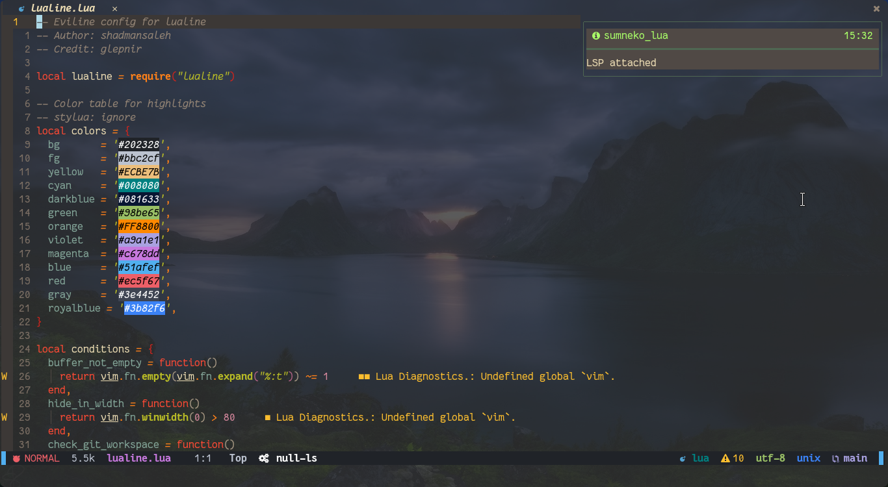
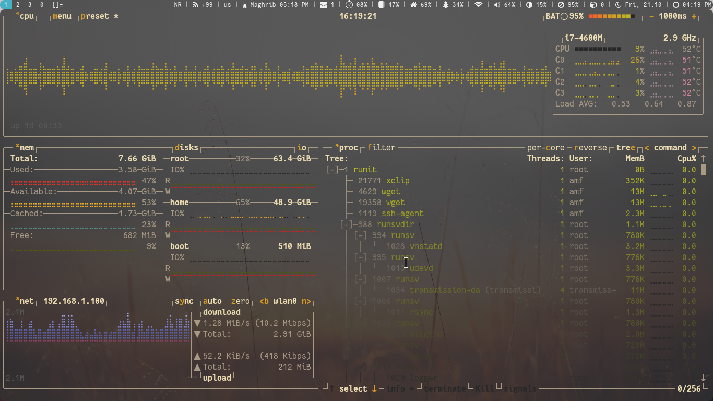
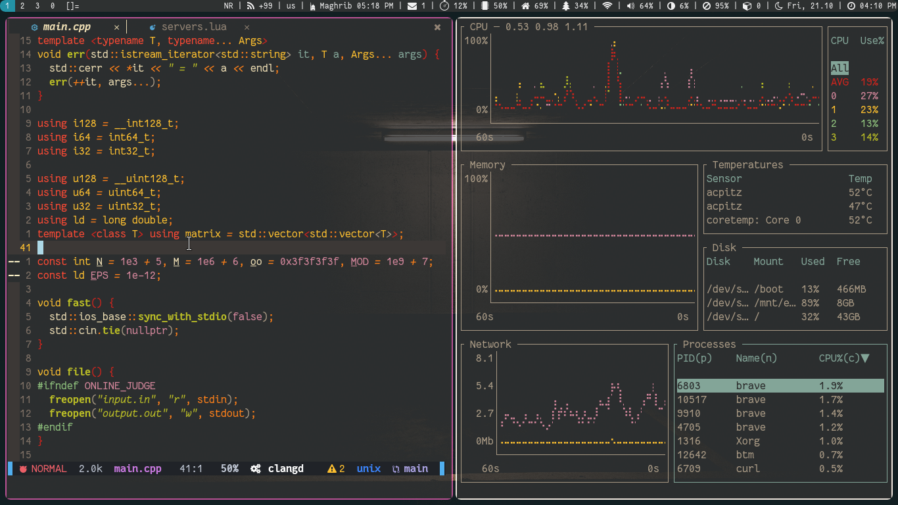
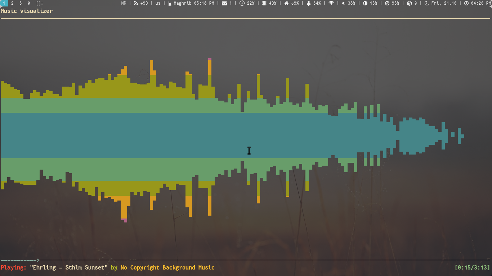

<h1 align="center">Artix Linux Rice (dotfiles)</h1>

<h4 align="center">Freedom has a price: Responsibility</h4>
<h4 align="center"> 📢 If you wanna use my configuration files, Use them at Your Own Risk 📢 </h4>

Here you will find the configuration for some of the software that I use.

## 📸 Preview

<h3 align="center">Emacs</h3>

<h3 align="center">Neovim</h3>

<h3 align="center">Btop</h3>

<h3 align="center">Neovim + Bottom</h3>

<h3 align="center">ncmpcpp</h3>

<!-- ## Installation -->

<!-- ## ⚙ Configuration -->

## ⚠️ License

Licensed under the [GPLv3](LICENSE) License.
